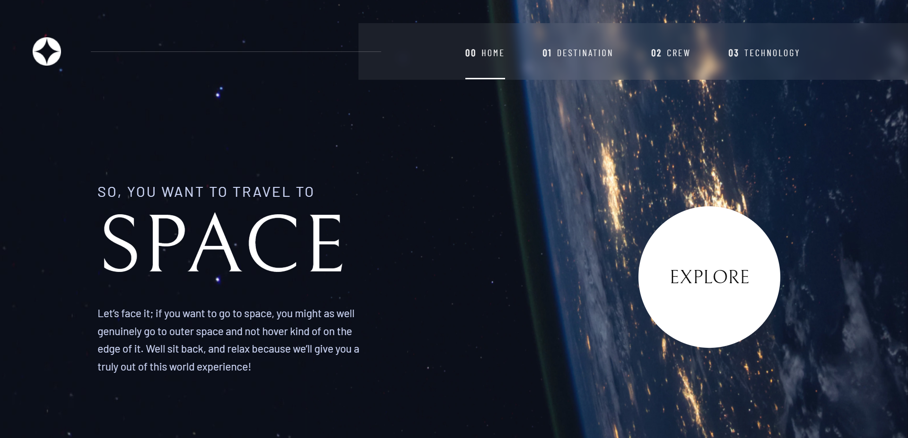
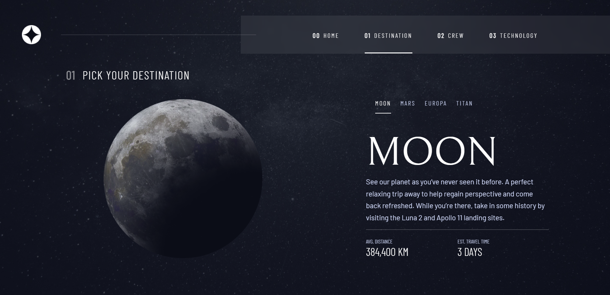
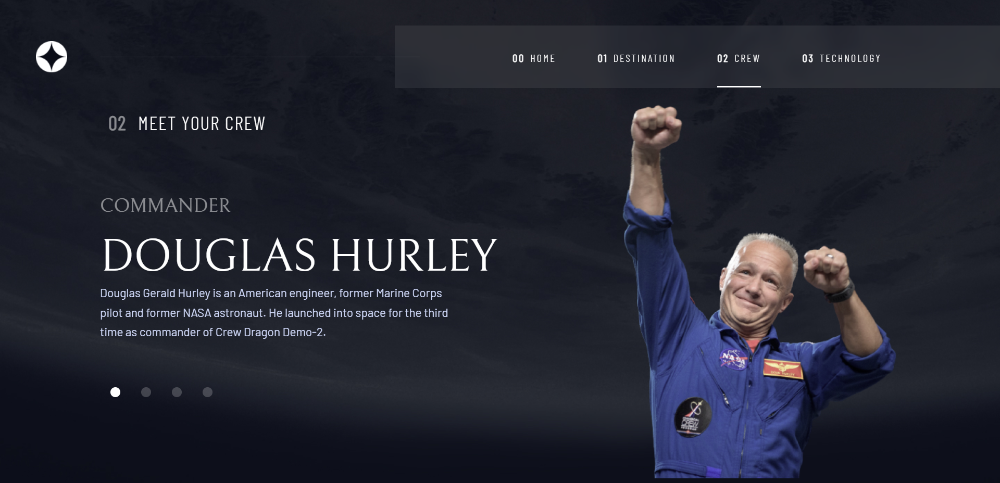
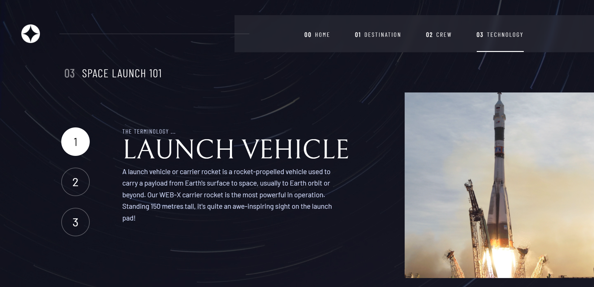
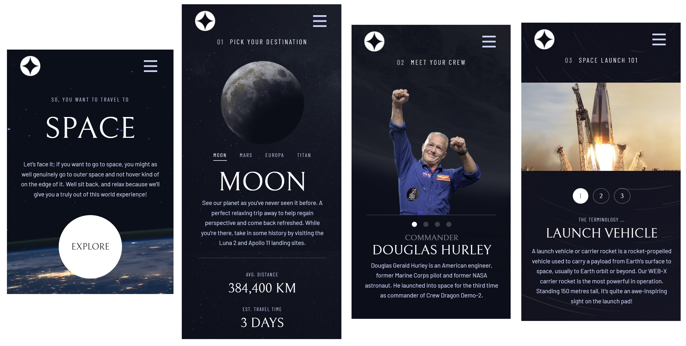

# space-tourism

- Javascript
- Vue3
- SCSS

#### Front-end Mentor
https://www.frontendmentor.io/challenges/space-tourism-multipage-website-gRWj1URZ3/hub/space-tourism-multipage-website-mBuEPjbBpg

#### github page
https://oodhmo.github.io/Space-Tourism/

  

### Still in development :exclamation: :exclamation:

  

- Developed part

  - Desktop screen

  
  
  
  

  - Tap screen
  

  - Mobile screen
  
